# WikiCodex

<p align="center">
  <a href="README.md">
    
  </a>
  <a href="README.en.md">
    
  </a>
</p>

<p align="center">
  <strong>Wiki privada de rol para campañas, fichas, reglas, permisos y herramientas de mesa.</strong>
</p>

<p align="center">
  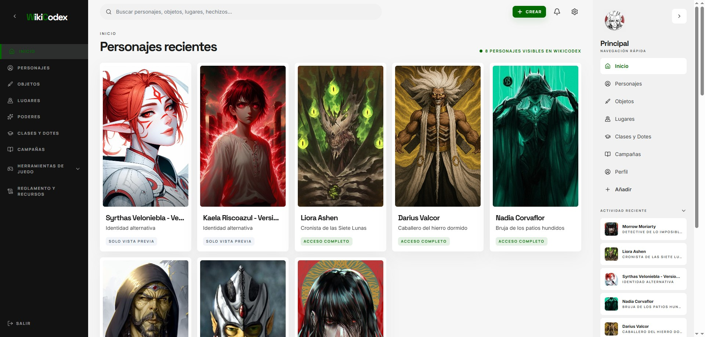
</p>

WikiCodex es una aplicación web para crear, organizar y consultar una wiki privada de rol de mesa. Está pensada para grupos que necesitan mantener en un mismo lugar sus campañas, personajes, objetos, lugares, partidas, hechizos, poderes, reglas, perfiles y notas de mundo sin perder control sobre qué puede ver cada jugador.

La aplicación combina fichas visuales avanzadas, texto wiki enlazado, herramientas de juego, reglamento integrado, biblioteca de hechizos y un sistema de privacidad validado desde el backend.

## Capturas

| Inicio | Ficha de personaje |
| --- | --- |
|  | 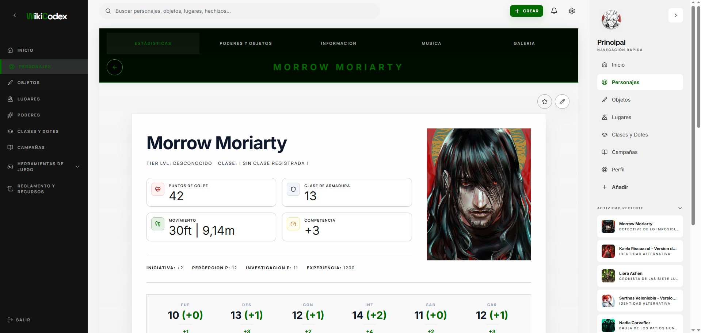 |

| Campañas | Detalle de campaña |
| --- | --- |
| 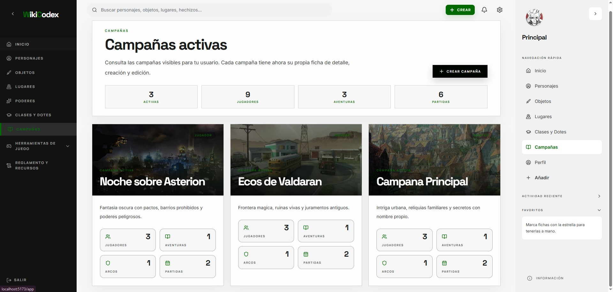 | 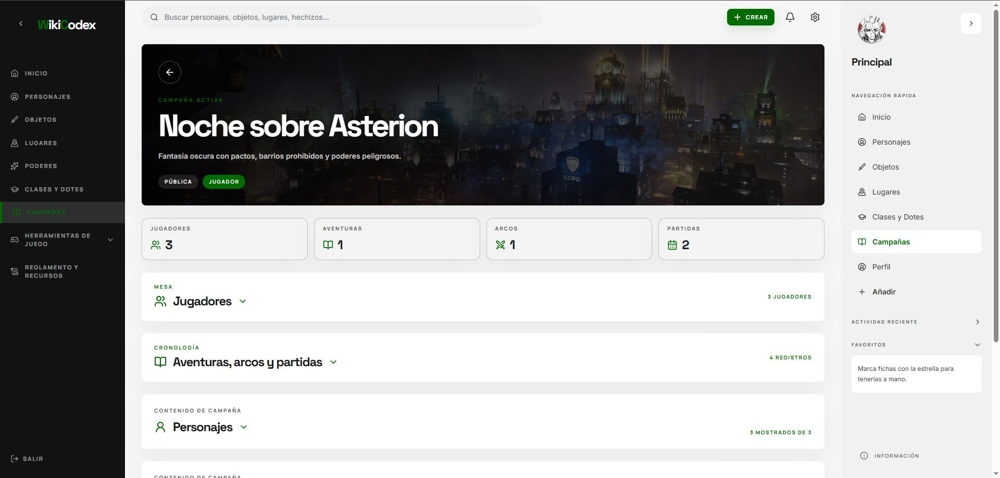 |

| Objetos | Lugares |
| --- | --- |
| 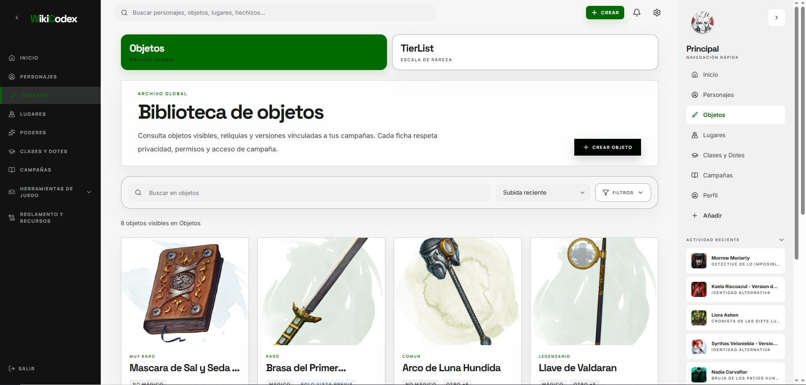 | 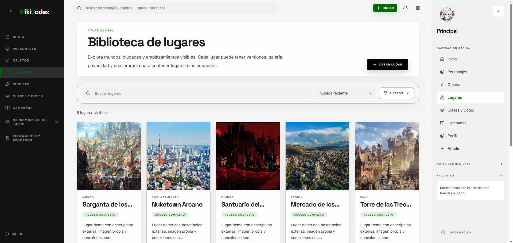 |

| Hechizos | Poderes |
| --- | --- |
| 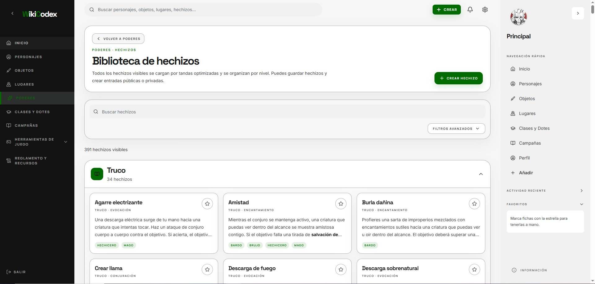 | 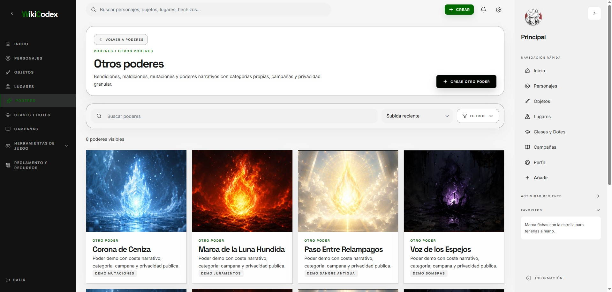 |

| Gestor de combate | Reglamento |
| --- | --- |
| 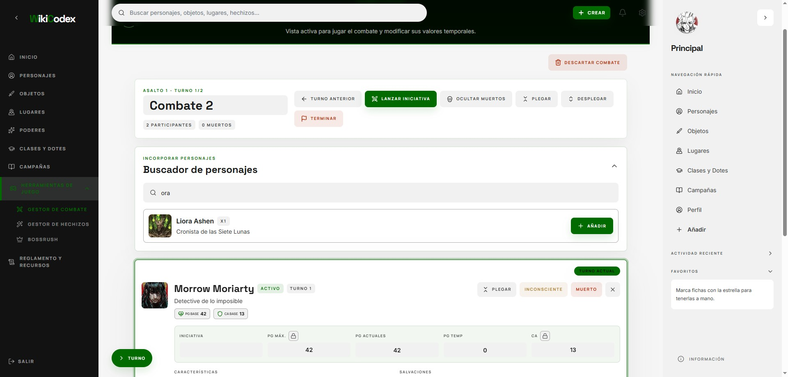 | 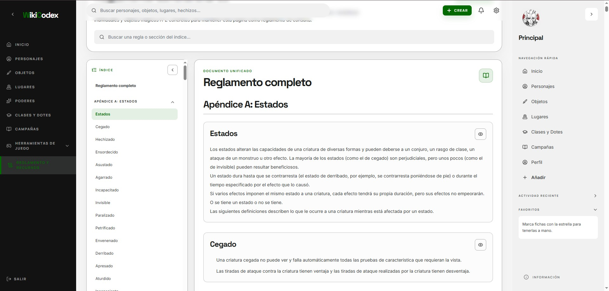 |

| Clases | Perfil y personalización |
| --- | --- |
| 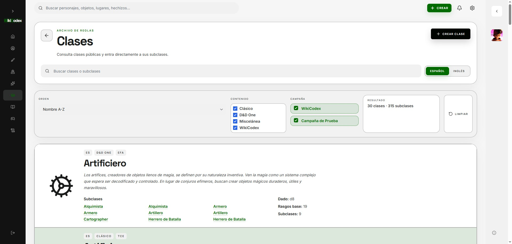 | 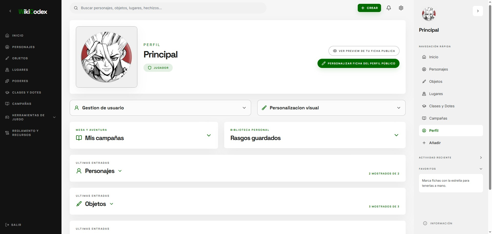 |

### Modo oscuro y paleta de colores

<p align="center">
  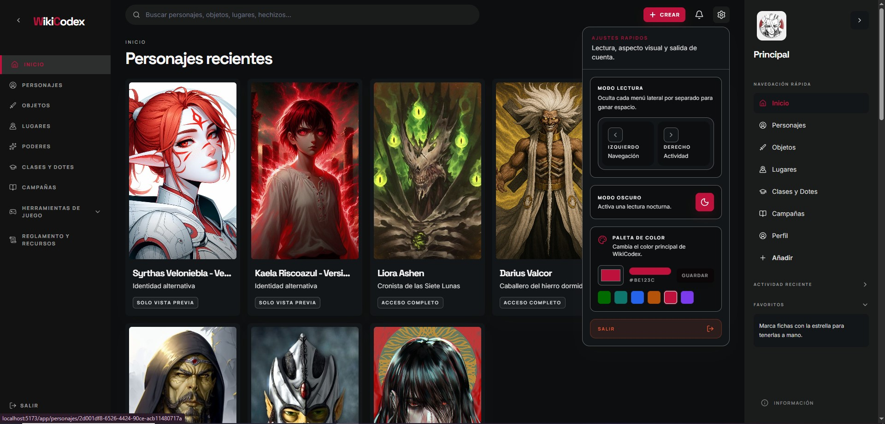
</p>

## Características principales

### Wiki de campaña

- Campañas públicas o privadas.
- Aventuras, arcos narrativos y partidas dentro de cada campaña.
- Personajes, objetos, lugares, hechizos y poderes vinculables a una o varias campañas.
- Fichas con imagen, galería, música, descripción, datos de juego y relaciones internas.
- Comentarios en fichas, favoritos, actividad reciente y búsqueda global.

### Fichas avanzadas

- Personajes con estadísticas, información narrativa, objetos, poderes, hechizos, música y galería.
- Rasgos agrupados por tipo, ordenables y reutilizables.
- Datos dinámicos en rasgos mediante `{...}` para mostrar valores vivos de la ficha.
- Versiones de personajes y objetos.
- Fichas de objetos y lugares con categorías, rasgos, privacidad y relaciones.
- Modos visuales para fichas: WikiCodex, Legado, Nocturno Arcano, Pergamino Antiguo, Tinta y Papel, Grimorio y Alto contraste.

### Privacidad real

WikiCodex está diseñado para campañas donde no todos los jugadores deben ver lo mismo. Los permisos se validan en el backend; la interfaz solo adapta la experiencia.

Modelos de visibilidad soportados:

- Completamente privado.
- Solo vista previa.
- Completamente público.
- Disponible para usuarios concretos.
- Visible por pertenencia o rol dentro de una campaña.

Reglas clave:

- Una campaña pública no vuelve públicos sus personajes, objetos, lugares o poderes.
- Los masters tienen permisos contextuales dentro de sus campañas.
- Los administradores pueden gestionar la aplicación completa.
- Perfiles públicos, destacados, búsqueda, favoritos, actividad, texto wiki y notificaciones respetan la privacidad.

### Texto wiki

Los campos largos pueden enlazar entidades internas y aplicar formato sencillo:

```txt
[[personaje:Nombre]]
[[objeto:Nombre|texto visible]]
**negrita**
*cursiva*
==destacado==
{Dato dinámico de ficha}
```

El autocompletado y la resolución de enlaces respetan la privacidad. Si un usuario no tiene permiso para ver una entidad enlazada, la aplicación evita exponer su contenido.

### Herramientas de juego

- Gestor de combate con iniciativa, turnos, asaltos, puntos de golpe temporales, CA temporal, notas y estados.
- Historial de combates terminados.
- Asociación de combates a partidas.
- Gestor de hechizos con lanzadores, slots, hechizos temporales y personajes visibles.
- Sección BossRush preparada como módulo futuro.

### Reglamento y recursos

- Reglamento general integrado en formato de lectura.
- Referencia rápida con búsqueda y secciones plegables.
- Clases, dotes y hechizos consultables desde la aplicación.
- Recursos externos y PDFs servidos mediante Cloudinary cuando están disponibles.

### Administración

- Estadísticas generales de la aplicación.
- Gestión de usuarios no administradores.
- Creación de usuarios normales.
- Cambio de contraseña de usuarios.
- Auditoría de acciones administrativas.
- Borrado controlado de usuarios y campañas.
- Protección adicional mediante clave de zona administrativa.
- Clave destructiva independiente para acciones irreversibles.

## Seguridad

- Autenticación con usuario, contraseña y clave secreta de registro.
- Contraseñas almacenadas con hash.
- Sesiones JWT.
- Sesión administrativa reforzada.
- Validación de entradas con esquemas.
- Cabeceras de seguridad en backend.
- Rate limiting en rutas sensibles.
- CORS configurado por entorno.
- Subidas de imágenes gestionadas mediante backend y Cloudinary.
- Secretos fuera del código fuente mediante variables de entorno.

## Experiencia de usuario

- Interfaz responsive para escritorio, tablet y móvil.
- Navegación lateral con secciones principales.
- Rail de acceso rápido con favoritos, actividad y herramientas.
- Modo claro y oscuro.
- Color principal configurable por usuario.
- Fichas visuales con imágenes, galerías y bloques plegables.
- Listados con filtros combinables.
- Demo estática separada para mostrar el proyecto sin consumir la instancia real.

## Stack técnico

| Capa | Tecnología |
| --- | --- |
| Frontend | React, Vite, React Router, TanStack Query, Tailwind CSS |
| Backend | Node.js, Express, Prisma |
| Base de datos | PostgreSQL |
| Validación | Zod |
| Autenticación | JWT |
| Media | Cloudinary |
| Despliegue | Vercel, Render, Supabase y Cloudinary |

## Casos de uso

WikiCodex encaja especialmente bien en:

- Campañas largas con mucho lore acumulado.
- Mesas donde el master necesita ocultar información a ciertos jugadores.
- Grupos con varias campañas conectadas en un mismo mundo.
- Partidas donde objetos, poderes o personajes cambian con el tiempo.
- Comunidades pequeñas que quieren una wiki privada con control de permisos.
- Preparación de sesiones con consulta rápida de reglas, hechizos y recursos.

## Estado del proyecto

WikiCodex se encuentra en una primera versión funcional avanzada. Ya cuenta con autenticación, privacidad, administración, fichas complejas, biblioteca de hechizos, herramientas de juego, reglamento integrado, Cloudinary y despliegue preparado para servicios gratuitos o de bajo coste.

Módulos preparados para evolución:

- BossRush.
- Sets de reglas.
- Más integraciones de recursos externos.
- Mejoras futuras de rendimiento y experiencia visual.

## Autoría

Proyecto creado por **Adrián Vilella Espony**.

- Email: [adrian.vilella.pro@gmail.com](mailto:adrian.vilella.pro@gmail.com)
- LinkedIn: [www.linkedin.com/in/adrián-vilella-espony-40a046410](https://www.linkedin.com/in/adri%C3%A1n-vilella-espony-40a046410)

